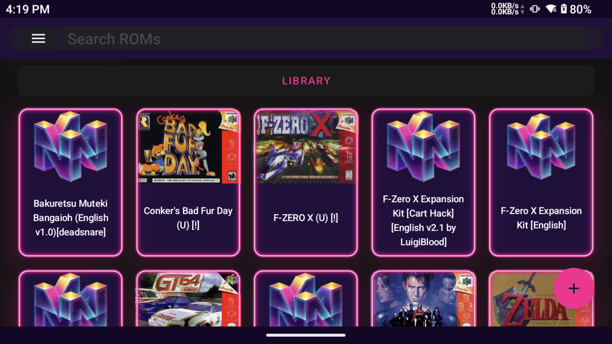
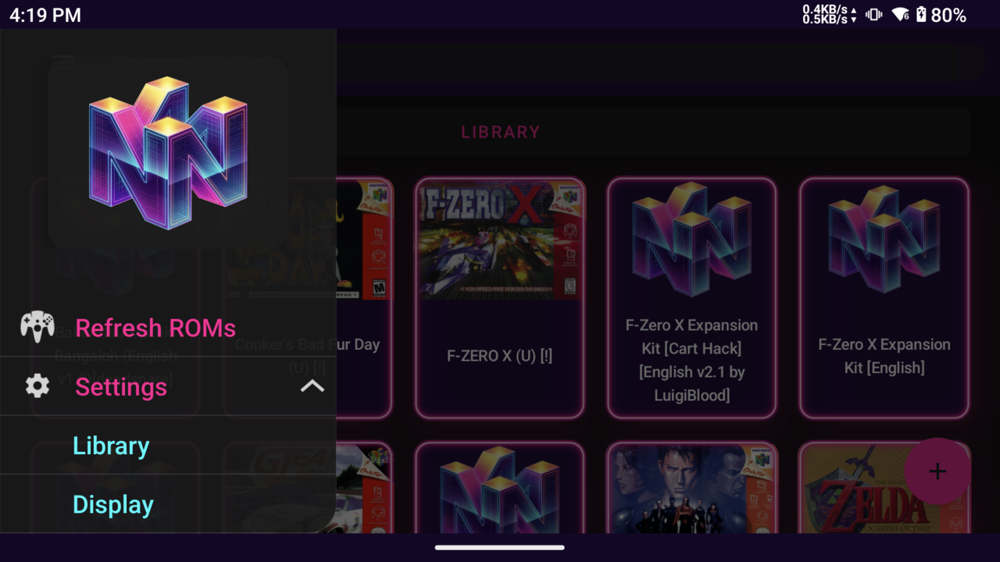
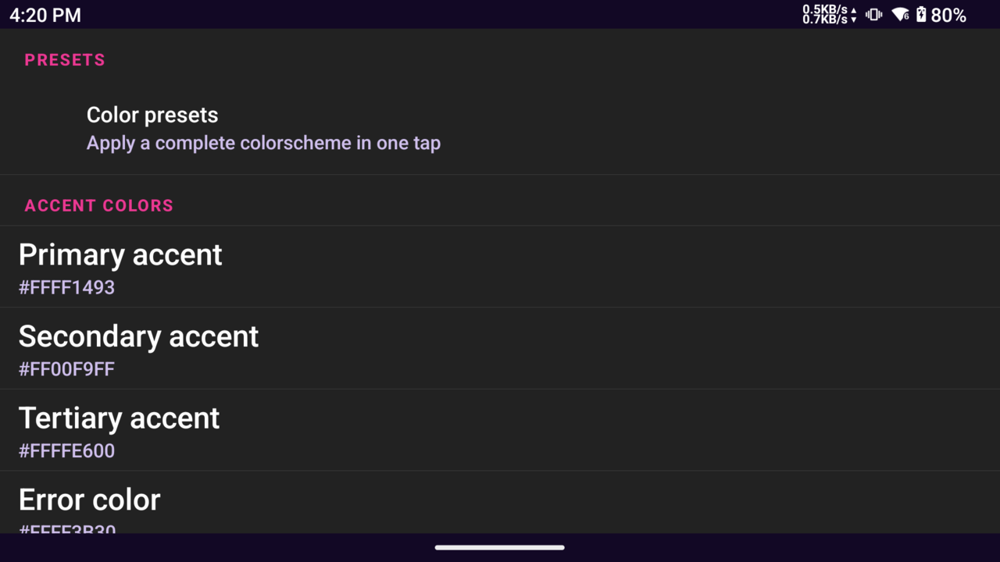
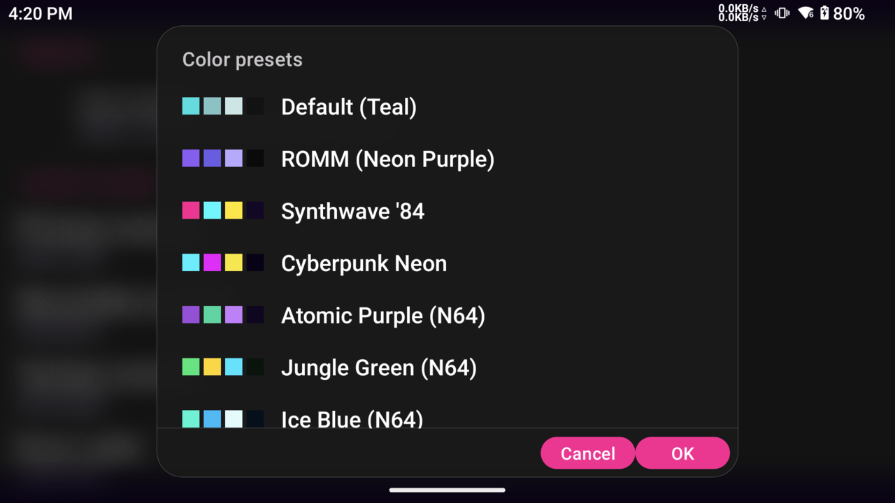

<p align="center">
  
</p>

<h1 align="center">Mupen64Plus-AE Turnip Edition</h1>

<p align="center">
  A modernized, high-performance fork of <b>Mupen64Plus-AE</b> featuring custom <b>Turnip GPU Driver integration</b>, an overhauled <b>Cyberpunk & Frosted Glass UI Engine</b>, multi-pass <b>Neon Light-Pipe Glow</b>, and full runtime theme customization.
</p>

<p align="center">
  <b>100% Free & Open-Source</b> &bull; No Ads &bull; No Analytics &bull; No Pro Gates &bull; Free Cloud Saves & Netplay
</p>

---

## What's New in v338

- **RetroAchievements support** — vendored rcheevos with native glue and a JNA bridge, a settings screen, password sign-in with session-token capture, and hardcore mode enforced across save states, slots, GameShark and cheats.
- **Gallery, orientation and theme fixes** — orientation changes are handled in place, the gallery keeps its draw-behind-system-bars behaviour across rotation, stale service broadcasts after gallery recreation are fixed (issue #1), the theme quick-switch crash from stacked `activity.recreate()` is fixed, and every dialog and popup now follows the app theme.
- **Large ROM support** — ROMs larger than 64 MB are accepted, fixing the B3313 new-save crash (issue #3).
- **Per-game GPU driver control** — corrected per-game driver labelling plus a per-game "force stock driver" option.
- **New neon branding** — the launcher icon, splash screen, notification icon, Android TV banner and web listing icons all use the neon "M" logo, and the launcher icon is now round with transparent corners on every code path.
- **Consistent release version** — version code **338**, with version name **3.0.338** plus the build commit hash.

[Download v338](https://github.com/pwnedbygary/mupen64plus-ae-turnip/releases/tag/v338) · [Full release notes](docs/RELEASE_V338.md)

## Screenshots

| Library | Navigation drawer |
| :---: | :---: |
|  |  |

| Theme accents | Color presets |
| :---: | :---: |
|  |  |

## N64DD and Expansion Kit support

- **Native F-Zero X Expansion Kit support** — preserves cartridge-first combo boot and the DD CPU/DMA and RSP fixes from the development build. The working configuration was demonstrated on the development build rather than re-confirmed since: native disk save and reopen, and writable-cart persistence, still need a device re-test, so keep backups.
- **F-Zero X EK Cart Hack works and saves** — the WritableROM fix allows the hack to save changes to its embedded Expansion Kit data, which would otherwise be treated as read-only cartridge ROM. This is separate from native N64DD support and works with N64DD disabled.
- **Per-game N64DD activation** — DD-specific behavior remains limited to games with N64DD explicitly enabled. WritableROM support for cartridge hacks remains independently controlled.

### Confirmed English Expansion Kit configuration

- F-Zero X **USA cartridge**
- English-translated **USA-region NDD**
- **Prototype USA IPL**
- **Dynamic Recompiler** and **Parallel RSP**

This configuration applies to the English translation; it is not a claim of compatibility with every cartridge, disk, or IPL combination.

**Installation and saves:** the signed release keeps the existing release package and signing identity, so it can update the earlier signed release without uninstalling. It does not replace the separate `.debug` beta or automatically transfer its private saves. Keep backups: full-restart persistence, custom-track saves, and writable-cart persistence have not been re-tested on the current binary. Device acceptance for v338 covered the signed release build on a Retroid Pocket 6 (Android 13): install, launch, launcher icon, splash and permission screen, and the notification icon were verified; the N64DD and Expansion Kit paths were not re-tested on this build.

### How the EK Cart Hack saves with WritableROM

The **F-Zero X EK Cart Hack** combines the cartridge game and Expansion Kit disk data into one extended ROM. It runs as a cartridge game, rather than using an external NDD and the emulated 64DD drive. However, its save operations still target the cartridge address space containing that embedded data.

Ordinary cartridge ROM is read-only. Without special handling, those writes do not update the ROM data, so the hack can run while its editor saves fail. Our **WritableROM** fix adds an opt-in persistence path for this behavior:

1. **Enable it only for the appropriate ROM.** The per-ROM database setting `WritableROM=True` enables the feature; other cartridges retain normal read-only behavior. It does not require N64DD activation.
2. **Capture the writes.** Both direct CPU writes and PI DMA transfers into cartridge ROM space update the emulator's in-memory ROM buffer. The game can then read its changes back during the same session.
3. **Store changes separately.** Modified bytes are mirrored into a `<game-name>.cart_ram` file in the configured save directory. A companion `<game-name>.cart_ram.idx` records the address and length of each written region. **The original ROM file is not modified.**
4. **Restore only what changed.** On the next launch, the emulator loads the original ROM and overlays only the regions recorded in the index before emulation starts. Untouched ROM data stays intact. Overlapping or adjacent index entries are merged, while gaps remain separate so unwritten areas are not overwritten with zeros.

This is what lets the Cart Hack **work and save**, despite placing writable Expansion Kit data inside what would normally be read-only ROM space. It is separate from native N64DD disk saving and from emulator save states.

**Backup advice:** keep the `.cart_ram` and `.cart_ram.idx` files together, along with the game's other save files. Exit emulation normally before copying them so buffered writes are closed; this mechanism is not a guarantee against data loss from a crash or force-stop. The re-test limitations noted above still apply.

## UI and driver highlights

- **Overhauled Glassmorphic & Neon UI**:
  - Multi-pass **Neon Light-Pipe Glow** with Gaussian falloff and white-hot filament center highlights.
  - Seamless frosted-glass card presentation with dynamic translucency and specular reflections.
  - Responsive **Glass Opacity** (20%–100%) and **Card Glow** (0%–100%) slider scaling.
  - Rounded navigation drawer with outline clipping and clean dialog button spacing.
- **Dynamic Programmatic Title Layout**:
  - Automatically measures the entire library with `StaticLayout` and `FontMetricsInt` so multi-line game names (e.g. 4+ line romhacks and regional editions) render with full vertical clearance and zero clipping.
- **27 Curated Console & Cyberpunk Themes**:
  - **N64 Funtastic Classics**: *Atomic Purple, Jungle Green, Ice Blue, Fire Orange, Smoke Black*.
  - **Nintendo Legends**: *Majora's Mask, Ocarina Gold, F-Zero Mute City, Star Fox Sector X, Game Boy Classic*.
  - **Cyberpunk & Synth**: *Synthwave '84, Cyberpunk Neon, Matrix Terminal, Sakura Bloom, OLED Pure Black*.
  - **Developer Favorites**: *ROMM (Neon Purple), Tokyo Night, Dracula, Catppuccin Mocha, Nord, Monokai, One Dark, Gruvbox, Solarized, GitHub Dark, Adwaita*.
- **Integrated Skydoves ColorPicker**:
  - Compact two-column color picker dialog with live HSV color wheel, brightness/alpha sliders, direct hex input, and gamepad button confirmation (**A** / **Start** to confirm, **B** to cancel).
- **Turnip GPU Driver System**:
  - In-app driver downloader from top release sources, driver management & compatibility checks, on-disk Vulkan pipeline cache, per-game overrides, and live benchmark mode.
- **New Package Identity**:
  - Migrated package ID to `org.mupen64plusae.turnip.pwnedbygary`.

---

## Features

- **Turnip GPU driver picker** — import any standard [AdrenoToolsDrivers](https://github.com/K11MCH1/AdrenoToolsDrivers) zip, or **download one directly in-app** from well-known release sources (K11MCH1/AdrenoToolsDrivers, StevenMXZ, The412Banner/Banners-Turnip, MrPurple666/purple-turnip, whitebelyash, nihui/mesa-turnip-android-driver). The driver is extracted to internal storage and loaded via [libadrenotools](https://github.com/bylaws/libadrenotools) when the **Parallel vulkan renderer** is selected.
- **Driver management** — shows installed driver version, required API level, library name, GPU model, and per-driver benchmark scores. Incompatible drivers are rejected on import with automatic update notifications when newer releases are published.
- **On-disk Vulkan pipeline cache** — the Parallel plugin persists its `VkPipelineCache` to internal storage, eliminating first-launch shader stutter.
- **Driver benchmark mode** — toggleable timed benchmark that measures average FPS to compare Turnip against system drivers.
- **ParaLLEl-RDP** Vulkan renderer with upscaling, texture filtering, and modern RDP accuracy.
- **All classic plugins**: GLideN64, glide64mk2, GLN64, Rice, Angrylion, plus HLE/cxd4/parallel RSPs.
- **RetroAchievements** — sign in from the app and track achievements while you play, with hardcore mode enforced on save states, slots, cheats, GameShark and fast-forward.
- **Netplay & Cloud Sync**: Local and room-based netplay, Google Drive cloud backup, touchscreen/controller profiles, and 7z/zip ROM support.
- **In-app update checker** — checks for new releases directly from GitHub and notifies you when an update is available.

---

## Requirements for the Turnip Driver

- 64-bit ARM device (`arm64-v8a`) running **Android 9 or newer** (Adreno GPU)
- A driver zip in AdrenoToolsDrivers format (containing `meta.json` and driver `.so`)

The custom driver applies to the **Parallel** plugin (the Vulkan renderer). If the driver fails to load on a specific device, the app falls back to the system Vulkan driver automatically.

---

## Compatibility

- Android 6.0 and newer (`minSdk 23`), built for Android 14 (`targetSdk 34`) and device-tested on Android 13
- `arm64-v8a` is the primary target; `armeabi-v7a`, `x86` and `x86_64` are packaged as well

---

## Downloads

| Build Type | Link |
| :--- | :--- |
| **Latest Signed Release — v338** | [Download v338](https://github.com/pwnedbygary/mupen64plus-ae-turnip/releases/tag/v338) |
| **Nightly CI Builds** | [![Build Status][Build]][Actions] |

[Actions]: https://github.com/pwnedbygary/mupen64plus-ae-turnip/actions/workflows/build.yml
[Build]: https://github.com/pwnedbygary/mupen64plus-ae-turnip/actions/workflows/build.yml/badge.svg

---

## Build Instructions

Prerequisites:
- Android SDK (Platform 34, Build Tools 34.0.0, NDK 26.1.10909125, CMake 3.22.1)
- JDK 17

```bash
git clone https://github.com/pwnedbygary/mupen64plus-ae-turnip.git
cd mupen64plus-ae-turnip
./gradlew assembleDebug
```

---

## License

Licensed under the **GNU General Public License v3.0**, following Mupen64Plus-AE. The vendored [libadrenotools](https://github.com/bylaws/libadrenotools) is BSD-2-Clause (see `adrenotools/LICENSE`).
