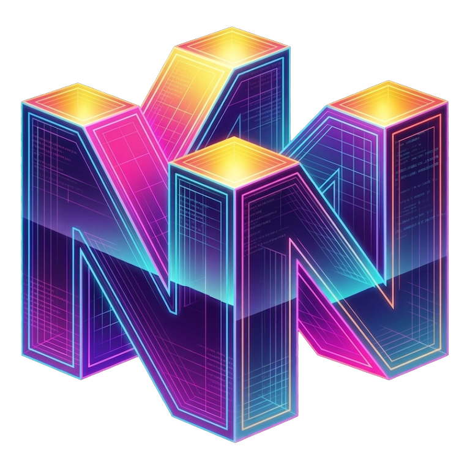

<p align="center">
  
</p>

<h1 align="center">Mupen64Plus-AE Turnip Edition</h1>

<p align="center">
  A modernized, high-performance fork of <b>Mupen64Plus-AE</b> featuring custom <b>Turnip GPU Driver integration</b>, an overhauled <b>Cyberpunk & Frosted Glass UI Engine</b>, multi-pass <b>Neon Light-Pipe Glow</b>, and full runtime theme customization.
</p>

<p align="center">
  <b>100% Free & Open-Source</b> &bull; No Ads &bull; No Analytics &bull; No Pro Gates &bull; Free Cloud Saves & Netplay
</p>

---

## What's New in v335

- **Overhauled Glassmorphic & Neon UI**:
  - Multi-pass **Neon Light-Pipe Glow** with Gaussian falloff and white-hot filament center highlights.
  - Seamless frosted-glass card presentation with dynamic translucency and specular reflections.
  - Responsive **Glass Opacity** (20%–100%) and **Card Glow** (0%–100%) slider scaling.
  - Rounded navigation drawer with outline clipping and clean dialog button spacing.
- **Dynamic Programmatic Title Layout**:
  - Automatically measures the entire library with `StaticLayout` and `FontMetricsInt` so multi-line game names (e.g. 4+ line romhacks and regional editions) render with full vertical clearance and zero clipping.
- **27 Curated Console & Cyberpunk Themes**:
  - **N64 Funtastic Classics**: *Atomic Purple, Jungle Green, Ice Blue, Fire Orange, Smoke Black*.
  - **Nintendo Legends**: *Majora's Mask, Ocarina Gold, F-Zero Mute City, Star Fox Sector X, Game Boy Classic*.
  - **Cyberpunk & Synth**: *Synthwave '84, Cyberpunk Neon, Matrix Terminal, Sakura Bloom, OLED Pure Black*.
  - **Developer Favorites**: *ROMM (Neon Purple), Tokyo Night, Dracula, Catppuccin Mocha, Nord, Monokai, One Dark, Gruvbox, Solarized, GitHub Dark, Adwaita*.
- **Integrated Skydoves ColorPicker**:
  - Compact two-column color picker dialog with live HSV color wheel, brightness/alpha sliders, direct hex input, and gamepad button confirmation (**A** / **Start** to confirm, **B** to cancel).
- **Turnip GPU Driver System**:
  - In-app driver downloader from top release sources, driver management & compatibility checks, on-disk Vulkan pipeline cache, per-game overrides, and live benchmark mode.
- **New Package Identity**:
  - Migrated package ID to `org.mupen64plusae.turnip.pwnedbygary`.

---

## Features

- **Turnip GPU driver picker** — import any standard [AdrenoToolsDrivers](https://github.com/K11MCH1/AdrenoToolsDrivers) zip, or **download one directly in-app** from well-known release sources (K11MCH1/AdrenoToolsDrivers, StevenMXZ, The412Banner/Banners-Turnip, MrPurple666/purple-turnip, whitebelyash, nihui/mesa-turnip-android-driver). The driver is extracted to internal storage and loaded via [libadrenotools](https://github.com/bylaws/libadrenotools) when the **Parallel vulkan renderer** is selected.
- **Driver management** — shows installed driver version, required API level, library name, GPU model, and per-driver benchmark scores. Incompatible drivers are rejected on import with automatic update notifications when newer releases are published.
- **On-disk Vulkan pipeline cache** — the Parallel plugin persists its `VkPipelineCache` to internal storage, eliminating first-launch shader stutter.
- **Driver benchmark mode** — toggleable timed benchmark that measures average FPS to compare Turnip against system drivers.
- **ParaLLEl-RDP** Vulkan renderer with upscaling, texture filtering, and modern RDP accuracy.
- **All classic plugins**: GLideN64, glide64mk2, GLN64, Rice, Angrylion, plus HLE/cxd4/parallel RSPs.
- **Netplay & Cloud Sync**: Local and room-based netplay, Google Drive cloud backup, touchscreen/controller profiles, and 7z/zip ROM support.
- **In-app update checker** — checks for new releases directly from GitHub and notifies you when an update is available.

---

## Requirements for the Turnip Driver

- 64-bit ARM device (`arm64-v8a`) running **Android 9 or newer** (Adreno GPU)
- A driver zip in AdrenoToolsDrivers format (containing `meta.json` and driver `.so`)

The custom driver applies to the **Parallel** plugin (the Vulkan renderer). If the driver fails to load on a specific device, the app falls back to the system Vulkan driver automatically.

---

## Downloads

| Build Type | Link |
| :--- | :--- |
| **Signed Release Builds** | [Latest Releases](https://github.com/pwnedbygary/mupen64plus-ae-turnip/releases) |
| **Nightly CI Builds** | [![Build Status][Build]][Actions] |

[Actions]: https://github.com/pwnedbygary/mupen64plus-ae-turnip/actions/workflows/build.yml
[Build]: https://github.com/pwnedbygary/mupen64plus-ae-turnip/actions/workflows/build.yml/badge.svg

---

## Build Instructions

Prerequisites:
- Android SDK (Platform 34, Build Tools 34.0.0, NDK 26.1.10909125, CMake 3.22.1)
- JDK 17

```bash
git clone https://github.com/pwnedbygary/mupen64plus-ae-turnip.git
cd mupen64plus-ae-turnip
./gradlew assembleDebug
```

---

## License

Licensed under the **GNU General Public License v3.0**, following Mupen64Plus-AE. The vendored [libadrenotools](https://github.com/bylaws/libadrenotools) is BSD-2-Clause (see `adrenotools/LICENSE`).
